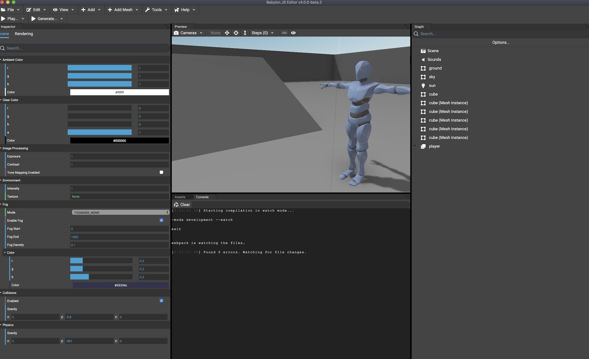
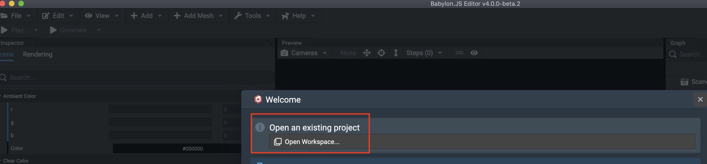
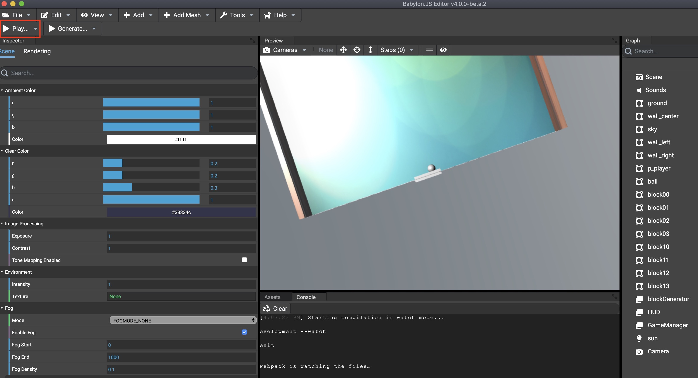
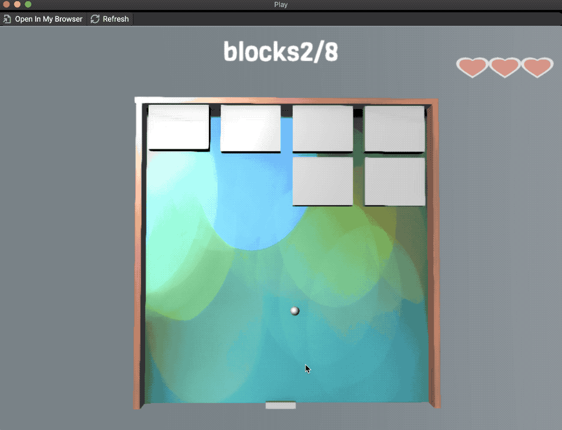

# A published examples from Babylon.js Editor v4.0 beta2

# Background

Babylon.js Editor has been updated as wonderful WebGL contents editor like Unity.  

The repository is an example of Babylon.js Editor project. 

# Make environment of Babylon.js Editor



1. Get Babylon.js Editor source  

```bash
$ git clone https://github.com/BabylonJS/Editor.git
```

2. Switch release branch and build

```bash
$ git checkout -b release/4.0.0 origin/release/4.0.0
$ npm install
$ npm run build
```

3. Run Babylon.js Editor.exe ( or Babylon.js Editor.app if you use Mac)  

```
electron-packages / windows /Babylon.js Editor.exe 
```

```
electron-packages / mac /Babylon.js Editor.app
```

# Run the sample project

1. Put the repo on any floder

2. Run Babylon.js Editor and select "workspace.editorworkspace" file  



3. Press Play button  



Another preview window is showed. You can also check your own browser by accessing "http://<IP address>:1338"

# About the sample

- A simple ping pong game  
- Key  
  A: left move  
  D: right move    
  space : Start play / Shoot sphere    

  

The repo is an experimental trial of Babylon.js Editor.  Therefore each of code are not refactored.

# Known issues

(1) Player can not move if you keep pressing A/D key at the end of left or right side.  

The following code in "p_player.ts" causes the issue. I'll fix it soon.

```ts
   //65 : A
    @onKeyboardEvent([65], KeyboardEventTypes.KEYDOWN)
    private _moveLeft():void{
        if( (this.position.z >= -21)&&(this.position.z <= 21)  ){
            this.translate( new Vector3(0,0,0.5),6,Space.WORLD);
           // console.log(this.position.z);
        }
    }

   //68 : D
    @onKeyboardEvent([68], KeyboardEventTypes.KEYDOWN)
    private _moveRight():void{
        if( (this.position.z >= -21)&&(this.position.z <= 21)  ){
         this.translate( new Vector3(0,0,-0.5),6,Space.WORLD);
       //  console.log(this.position.z);
        }
    }
```

(2) Sphere sometimes does not back to player   

Reload the page if the issue happens.   

(3) Sphere sometimes flys on Y axis.  

The ping pong game is set on X and Z axis (Player move on Z axis). 